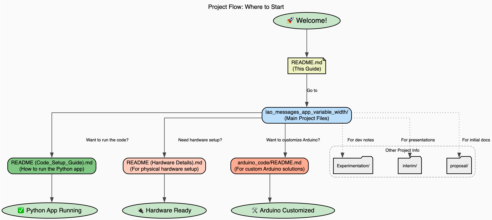

# Understanding the Project Structure
Author: Oliver Lee, Diya Thomas

The following flowchart should help you navigate the Lao Bytecode project:

Links to READMEs:

[README Hardware](lao_messages_app_variable_width/README_Hardware_Details.md)

[README Glyph Bitmap Generator](lao_messages_app_variable_width/README%20%28Bitmap%20Generator%20Function%20Explainer%29.md)

[README Code Setup Guide](lao_messages_app_variable_width/README%20%28Code_Setup_Guide%29.md)

[Understanding preprocess_string.py](lao_messages_app_variable_width/README%20%28Understanding_preprocess_string.py%29.md)

[Arduino Code README](lao_messages_app_variable_width/arduino_code/README.md)

