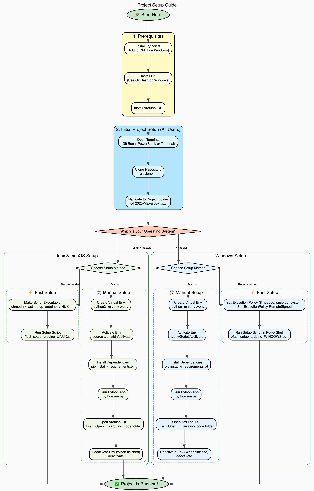

# `lao_messages_app_variable_width` Setup Guide & 'Fast Setup' Explanation
Author: Oliver Lee, Technical contributors: Oliver Lee

This guide explains how to set up and run the `lao_messages_app_variable_width` project on both Linux-based systems and Windows. 

---

## **Setup Flowchart**
<details>
<summary>Click to view the setup flowchart</summary>



</details>

---

## **Prerequisites**

<details>
<summary>Click to view required software</summary>

Before you begin, please ensure you have the following software installed on your system.

* **Python 3:** Required to run the application's backend scripts.
    * Download from the official [Python website](https://www.python.org/downloads/).
    * **Windows Users:** During installation, make sure to check the box that says **"Add Python to PATH"**. This is crucial for Python commands to work correctly from your terminal.

* **Git:** Needed to clone the project repository from GitHub.
    * Install from the official [Git website](https://git-scm.com/downloads).
    * **Windows Users:** We recommend using **Git Bash**, which is included with the Git for Windows installation. It provides a Linux-like command-line environment that's often easier for Git operations.

* **Arduino IDE:** Required to upload the generated code to your Arduino board.
    * Download from the official [Arduino Software page](https://www.arduino.cc/en/software). Make sure to choose the correct version for your operating system.
</details>

---

## **Step 1: Initial Project Setup (All Users)**

<details>
<summary>Click to view initial setup steps (required for everyone)</summary>

These first three steps are required for **all operating systems** and both setup methods.

1.  **Open Your Terminal**
    * On Windows, we recommend opening **Git Bash** or **PowerShell**. You can usually find them by searching in your Start Menu.
    * On macOS or Linux, open your standard **Terminal** application (e.g., from Applications > Utilities on macOS, or your distribution's applications menu on Linux).

2.  **Clone the Repository**
    Navigate to a suitable directory where you want to store the project (e.g., your Documents or Desktop folder), then run the following command. This downloads the entire project from GitHub to your local machine.
    ```bash
    git clone [https://github.com/Technology-for-the-Poorest-Billion/2025-MakerBox-Bytecode.git](https://github.com/Technology-for-the-Poorest-Billion/2025-MakerBox-Bytecode.git)
    ```

3.  **Navigate to the Project Folder**
    Once cloned, change your current directory into the specific project folder using this command:
    ```bash
    cd 2025-MakerBox-Bytecode/lao_messages_app_variable_width
    ```
    This ensures all subsequent commands are run from the correct location within the project.
</details>

---

## **Linux & macOS Setup**

Choose one of the two methods below. The fast setup is recommended for its simplicity.

<details>
<summary>Method 1: Fast Setup</summary>

### Method 1: Fast Setup ⚡

This method uses a shell script to automate the entire setup process.

1.  **Make the Script Executable:**
    Before running, you need to give the script permission to execute:
    ```bash
    chmod +x fast_setup_arduino_LINUX.sh
    ```

2.  **Run the Setup Script:**
    Now, execute the script. It will handle creating the Python virtual environment, installing necessary packages, launching the application, and opening the Arduino IDE for you.
    ```bash
    ./fast_setup_arduino_LINUX.sh
    ```
</details>

<details>
<summary>Method 2: Manual Setup</summary>

### Method 2: Manual Setup 🛠️


For those who prefer a step-by-step approach, follow these instructions.

1.  **Create a Python Virtual Environment:**
    It's good practice to create a virtual environment to isolate the project's Python dependencies from your system-wide Python installation. This prevents conflicts.
    ```bash
    python3 -m venv .venv
    ```
    This command creates a new folder named `.venv` in your current directory, containing a private Python environment.

2.  **Activate the Virtual Environment:**
    You need to "activate" this environment so that your terminal uses its Python and installed packages instead of your system's.
    ```bash
    source .venv/bin/activate
    ```
    Your terminal prompt should change (e.g., `(.venv) your_username@your_machine:~/your_project$`) indicating the virtual environment is active.

3.  **Install Python Dependencies:**
    With the virtual environment active, install all required Python libraries listed in `requirements.txt`.
    ```bash
    pip install -r requirements.txt
    ```
    This command reads the `requirements.txt` file and downloads/installs all specified packages into your `.venv` environment.

4.  **Run the Python Application:**
    Now you can start the main Python application.
    ```bash
    python run.py
    ```
    This command executes the `run.py` script, which is the core of the `lao_messages_app_variable_width` project.

5.  **Launch Arduino IDE:**
    * Open the **Arduino IDE** application manually.
    * Go to `File > Open...` and navigate to the project's `arduino_code` folder (e.g., `2025-MakerBox-Bytecode/lao_messages_app_variable_width/arduino_code`).
    * Open the main sketch file: `arduino_code.ino`. This is where the Arduino code generated by the Python application will be uploaded.

6.  **Deactivate Virtual Environment:**
    When you're finished working on the project, you can exit the virtual environment to return to your regular system terminal environment.
    ```bash
    deactivate
    ```
</details>

---

## **Windows Setup**

Choose one of the two methods below. The fast setup is recommended for its simplicity.

<details>
<summary>Method 1: Fast Setup</summary>

### Method 1: Fast Setup ⚡

This method uses a PowerShell script to automate the entire setup process.

1.  **Run the Setup Script in PowerShell:**
    * **Important Note on Execution Policy:** You may need to adjust your system's PowerShell execution policy to allow scripts to run. If the script fails with an error related to execution policy, open PowerShell as an **Administrator** (right-click PowerShell in the Start Menu and select "Run as administrator") and run:
        ```powershell
        Set-ExecutionPolicy RemoteSigned
        ```
        Press `Y` to confirm. You generally only need to do this once per machine. After setting it, you can close the admin PowerShell window.
    * In your regular (non-admin) PowerShell terminal, run the script:
        ```powershell
        .\fast_setup_arduino_WINDOWS.ps1
        ```
    The script will take care of creating the Python virtual environment, installing Python packages, launching the application, and opening the Arduino IDE for you.

</details>

<details>
<summary>Method 2: Manual Setup</summary>

### Method 2: Manual Setup 🛠️

For those who prefer a step-by-step approach, follow these instructions.

1.  **Create a Python Virtual Environment:**
    It's good practice to create a virtual environment to isolate the project's Python dependencies from your system-wide Python installation. This prevents conflicts.
    ```bash
    python -m venv .venv
    ```
    This command creates a new folder named `.venv` in your current directory, containing a private Python environment.

2.  **Activate the Virtual Environment:**
    You need to "activate" this environment so that your terminal uses its Python and installed packages instead of your system's.
    * In **Git Bash** or **PowerShell**:
        ```bash
        source .venv/Scripts/activate
        ```
    * In **Windows Command Prompt (CMD)**:
        ```cmd
        .\.venv\Scripts\activate
        ```
    Your command prompt should change (e.g., `(.venv) C:\your_project>`) indicating the virtual environment is active.

3.  **Install Python Dependencies:**
    With the virtual environment active, install all required Python libraries listed in `requirements.txt`.
    ```bash
    pip install -r requirements.txt
    ```
    This command reads the `requirements.txt` file and downloads/installs all specified packages into your `.venv` environment.

4.  **Run the Python Application:**
    Now you can start the main Python application.
    ```bash
    python run.py
    ```
    This command executes the `run.py` script, which is the core of the `lao_messages_app_variable_width` project.

5.  **Launch Arduino IDE:**
    * Open the **Arduino IDE** application manually.
    * Go to `File > Open...` and navigate to the project's `arduino_code` folder (e.g., `2025-MakerBox-Bytecode\lao_messages_app_variable_width\arduino_code`).
    * Open the main sketch file: `arduino_code.ino`. This is where the Arduino code generated by the Python application will be uploaded.

6.  **Deactivate Virtual Environment:**
    When you're finished working on the project, you can exit the virtual environment to return to your regular system terminal environment.
    ```bash
    deactivate
    ```
</details>