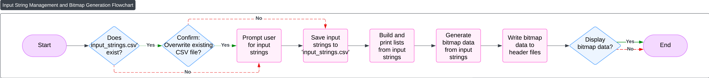

# Understanding `preprocess_strings.py`
Author: Oliver Lee  
Technical contributors: Oliver Lee

`preprocess_strings.py` contains the utilities used for the first step in the process of displaying complex scripts such as Lao: processing the strings the user would like to display into individual displayable units, called graphemes. Later on, code developed by Oisín Conlon will convert these graphemes into bitmaps, ready for display on hardware using code developed by Diya Thomas.

The wider project process is illustrated in the following flowchart:


## How it Works

The script operates through several core functions:

### 1. Decomposing Strings into Grapheme Clusters

The `decompose_string_to_clusters(s)` function is critical. It takes an input string and splits it into **grapheme clusters**, which are what a human perceives as a single character, even if composed of multiple Unicode code points (e.g., an 'e' with an accent mark like 'é'). This is achieved using the `grapheme` library, which adheres to the Unicode Text Segmentation standard.

```python
import grapheme

def decompose_string_to_clusters(s):
    """
    Splits a string into Unicode grapheme clusters (what a human sees as one character),
    using the ICU-standard grapheme segmentation.
    """
    return list(grapheme.graphemes(s))

# Example:
# decompose_string_to_clusters("héllo") will yield ['h', 'é', 'l', 'l', 'o'] # For Lao, it handles base characters and combining marks correctly.
```
### 2. Input String Collection
If a CSV listing all the phrases the user wants to display exists, it can be preloaded, otherwise direct user input is required and the CSV is saved for future use. To achieve this there are three helper functions
* **`get_input_strings_from_csv(file_path)`**:

```python
import csv
def get_input_strings_from_csv(file_path):
    """
    Reads a CSV file and extracts one sentence per line.
    """
    input_list = []
    with open(file_path, 'r', encoding='utf-8') as f:
        reader = csv.reader(f)
        for row in reader:
            if row:
                sentence = ' '.join(row).strip()
                input_list.append(sentence)
    return input_list
```
* **`get_input_strings()`**: 
```python
def get_input_strings():
    """
    Collects strings from user input interactively.
    """
    print("Enter strings one by one. Press Enter on an empty line to finish.")
    input_list = []
    while True:
        s = input("Enter string: ")
        if s == "":
            break
        input_list.append(s)
    return input_list
```
* **`save_strings_to_csv(input_list, file_path)`**: 
```python
def save_strings_to_csv(input_list, file_path):
    """
    Saves a list of strings to a CSV file, one string per row.
    """
    with open(file_path, 'w', encoding='utf-8', newline='') as f:
        writer = csv.writer(f)
        for string in input_list:
            writer.writerow([string])
```
### 4. Building Character and Index Mappings
The `build_char_and_index_lists(input_list)` function is the core of our memory compact system. It converts human-readable strings into a compact representation.

Its functionality is illustrated in the following flowchart: 


1.  It iterates through each input string, decomposing it into grapheme clusters.
2.  It builds a list of all unique grapheme clusters encountered across all input strings.
3.  Each unique cluster is assigned a numerical index.
4.  Finally, each original input string is translated into a list of these numerical indices.

The function returns two lists:

* **`char_list`**: The master list of all unique grapheme clusters. In the example of 'héllo', this would be [h, é, l, l, o]

* **`index_list`**: A list where each element is another list of integers, representing an original input string as a sequence of indices into **`char_list`**.

```python
def build_char_and_index_lists(input_list):
    """
    Builds a list of unique grapheme clusters and indexes input strings based on them.
    """
    all_clusters = []
    index_list = []
    cluster_to_index = {}

    for s in input_list:
        clusters = decompose_string_to_clusters(s)
        indices = []

        for cluster in clusters:
            if cluster not in cluster_to_index:
                cluster_to_index[cluster] = len(all_clusters)
                all_clusters.append(cluster)
            indices.append(cluster_to_index[cluster])
        index_list.append(indices)

    char_list = [cluster for cluster in all_clusters]
    return char_list, index_list
```
### 5. Exporting to C++ Header File
The `write_index_list_to_header(index_list, filename)` function handles exporting the processed data into a C++ header file (`.h`). This makes the data directly usable for the arduino code written by Diya

The header file generates several C-style arrays:

* **`all_phrases[]`**: A flattened array containing all grapheme cluster indices from all phrases, concatenated.
* **`phrase_starts[]`**: An array indicating the starting index of each phrase within `all_phrases[]`.
* **`phrase_lengths[]`**: An array indicating the length (number of grapheme clusters) of each phrase.
* **`num_phrases`**: A constant defining the total number of phrases.

This structure allows the arduino to efficiently retrieve any specific phrase by looking up its start index and length.

```python
import os
def write_index_list_to_header(index_list, filename="./arduino_code/phrases_to_display.h"):
    """
    Writes the index list to a C++ header file.
    """
    starts = []
    lengths = []
    current_start = 0
    for phrase in index_list:
        starts.append(current_start)
        lengths.append(len(phrase))
        current_start += len(phrase)

    num_phrases = len(index_list)

    with open(filename, "w") as f:
        f.write("#ifndef PHRASES_TO_DISPLAY_H\n")
        f.write("#define PHRASES_TO_DISPLAY_H\n\n")

        f.write("const uint8_t all_phrases[] = {\n")
        for phrase in index_list:
            f.write("    ")
            f.write(", ".join(str(i) for i in phrase))
            f.write(",    // phrase {}\n".format(index_list.index(phrase) + 1))
        f.write("};\n\n")

        f.write("const uint8_t phrase_starts[] = {")
        f.write(", ".join(str(s) for s in starts))
        f.write("};     // starting index of each phrase\n")

        f.write("const uint8_t phrase_lengths[] = {")
        f.write(", ".join(str(l) for l in lengths))
        f.write("};    // length of each phrase\n")

        f.write(f"const uint8_t num_phrases = {num_phrases};\n\n")

        f.write("#endif\n")

    header_size_kb = os.path.getsize(filename) / 1024
    print(f"Index header file size: {header_size_kb:.2f} KB")
```
## Strengths and Weaknesses
### Strengths
* **Robust Unicode Handling**: This script handles complex Unicode characters like those in Lao script, ensuring they're correctly segmented and displayed as single units using the `grapheme` library.
* **Memory Efficiency**: It's highly memory-efficient for embedded systems. By creating a unique character set and representing strings as numerical indices, we significantly reduce the amount of data the device needs to store.
* **Flexible Input Methods**: Input strings can be provided by either loading them from a CSV file or by typing them in interactively through the terminal.
* **Direct C++ Integration**: The script directly outputs a C++ header file, streamlining the process of using the pre-processed text.

### Weaknesses
* **No Dynamic String Creation on Device**: This system is tailored for pre-defined phrases. The arduino cannot display entirely new strings on the fly.