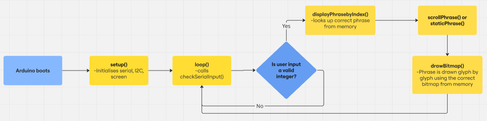
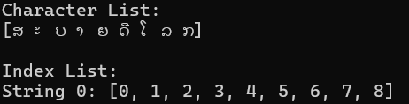
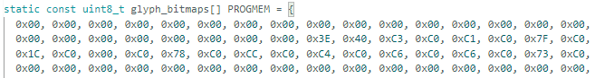
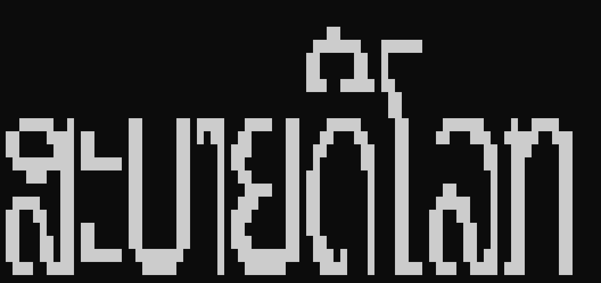

## How it works

The flowchart outlines the overall logic of our solution. The first two steps are performed by a Python script on a computer and involve preprocessing input phrases to generate header files. These files are then used by a microcontroller to display text on a screen.

### Step 1
The script scans the input CSV file and identifies unique graphemes (individual characters or character clusters) across all phrases using the `build_char_and_index_lists` function. This avoids redundant encoding of the same character bitmap and optimizes memory use—crucial for devices with limited storage.

Eg. The phrase **ສະບາຍດີໂລກ** (hello world) gets processed into the unique graphemes and the order in which they occur (in this phrase there are no repeated graphemes):

### Step 2
Each grapheme is passed to the `generate_bitmaps_for_chars` function, where it is rendered into an image using a TTF font and shaped using HarfBuzz. This image is then converted into a bitmap—a binary representation of the pixel data. The bitmap size is determined by the user-defined font size. The resulting data, including character bitmaps and phrase indexing information, is stored in header files, along with additional arrays that help the microcontroller interpret and retrieve the correct the bitmaps from memory. To assist with validation, we include a `display_bitmap_row` debugging function. This displays each rendered bitmap on the computer terminal so users can visually verify that the output is correct before flashing it to the microcontroller.

The Bitmap stored in a byte array:

The ouput of `display_bitmap_row`:

### Step 3 
The Arduino reads the header files and displays the selected phrase using one of two custom functions: `scrollPhrase` (ideal for long text or small screens) or `staticPhrase` (useful for E-Ink displays in low-power environments). Users can select a phrase by entering its number (e.g. 1, 2, 3...), and the system automatically calls the `displayPhraseByIndex` function to trigger the display. For our proof of concept, Serial communication is used to send the phrase number, but the system is modular enough to be extended to other input methods, including wireless protocols like LoRa or Wi-Fi—as long as the phrase number is passed to the same logic.

In our hello world example from above, there is only 1 phrase loaded to the arduino - so you would type 1 into the Serial monitor to display it.

## Video Demos
The system supports both static and scrolling text. Demonstration videos can be found below:

## Compatibility
Our solution supports variable font sizes, multiple languages (via user-provided TTF fonts), and a variety of screen types. It uses standard Arduino functions and is modular enough to be adapted to other microcontrollers or applications. Installation is simple: run the setup script to install all required libraries, upload your CSV file,  type `python run.py` in terminal, and connect your display to the microcontroller.
